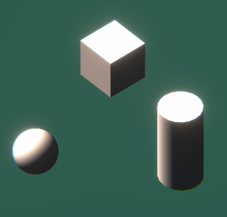
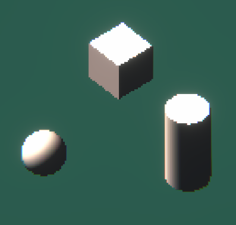

# Pixelize URP Shader

A pretty simple pixelize shader for URP, using a RenderFeatuer.

## Features

* Crisp pixelization.
* Ease-of-use Shader Graph

## Getting Started

* Add Universal Render Pipeline package into your project.  
* Add contents of this repo anywhere in the project.  
* Add Pixelize render feature into your URP Asset  
* Add Pizelate post process Component into your Post-Processing stack  
* Sett Size to around 350  
* Enjoy!  

## Preview

  
  

## Contact

Developed by Andrew Dioinecail.  
Twitter: [Dioinecail](https://twitter.com/dioinecail).  
Email: andrewdionecail@gmail.com  
  
Feel free to ask questions!  